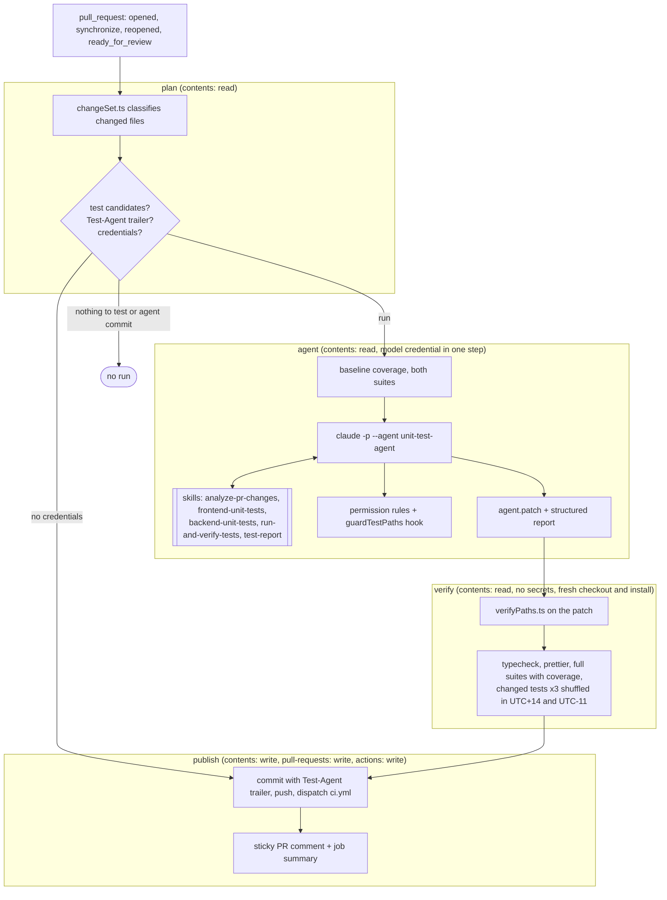

# Unit test agent for Taskly

A Claude Code agent with five project skills writes and updates unit tests for the React frontend and the FastAPI backend. A GitHub Actions workflow runs it on every ready pull request, checks the result again in a clean environment without trusting the agent, pushes the tests to the PR branch only if every check passes, and reports decisions, findings, verification and coverage in a sticky PR comment.

The same agent, run in coverage mode, is how missing tests for the existing codebase are added.

## Architecture



## Where things live

| Path | Purpose |
|---|---|
| `.claude/agents/unit-test-agent.md` | The agent: role, non-negotiable rules, decision procedure, budget behaviour. Preloads the five skills, tools limited to Read, Grep, Glob, Edit, Write, Bash and `StructuredOutput` (the tool `--json-schema` answers through), `maxTurns: 150` as a hard ceiling (the CLI sets the per-mode limit: 80 for PRs, 150 for coverage runs). |
| `.claude/skills/analyze-pr-changes/` | How to get and read the change set, when tests are and are not needed. `scripts/changeSet.ts` produces the change set JSON from git; `scripts/classify.ts` holds the classification rules (area, kind, test candidate, convention and related tests). |
| `.claude/skills/frontend-unit-tests/` | Vitest, Testing Library and user-event conventions of this repo: design-system mocks, `todoFixture`, mocking `lib/http` and `todosApi`, React Query hooks with a fresh `QueryClient`, fake timers, anti-patterns. |
| `.claude/skills/backend-unit-tests/` | pytest conventions: layout mirroring `app/`, conftest fixtures, `TestClient` with dependency overrides, `Session` mocks and statement comparison, config, lifespan and factory without a database. |
| `.claude/skills/run-and-verify-tests/` | `scripts/runTests.ts` (every test, typecheck and format run goes through it) and `scripts/coverageSummary.ts` (per-file and changed-line coverage JSON). |
| `.claude/skills/test-report/` | The report contract and `report.schema.json` (decisions, skills used, findings, commands), passed to the CLI with `--json-schema`. |
| `.claude/hooks/` | `pathPolicy.ts` (the single definition of writable paths) and `guardTestPaths.ts` (PreToolUse hook). |
| `.claude/testAgent.settings.json` | Least-privilege permissions and the hook registration, passed to every agent run with `--settings`. |
| `.github/workflows/testAgent.yml` | The PR workflow: plan, agent, verify, publish. |
| `.github/workflows/ci.yml` | Regular CI: frontend (typecheck, prettier, Vitest with coverage), backend (pytest with coverage), tooling tests. |
| `.github/testAgent/` | Workflow scripts (`buildPrompt.ts`, `verifyPaths.ts`, `coverageDelta.ts`, `renderReport.ts`), prompt templates and the tooling test suite. |
| `scripts/runTestAgent.sh` | Local entry point with the same flags and verification as CI. |

## Decisions and rationale

**Claude Code CLI, headless, project-scoped.** The agent, skills, permissions and hook are plain files in the repository, reviewed like code, and the same definition runs locally and in CI. `claude -p --agent unit-test-agent` makes the custom agent the main session, so its system prompt, tool list and preloaded skills apply directly; `--json-schema` turns the final answer into validated JSON. I did not use `claude-code-action` because I wanted the verification and the write token in separate jobs and full control over what reaches the prompt. The Agent SDK would have meant maintaining a harness that the CLI already provides.

**The model decides, scripts do the mechanics.** Anything with one right answer is code with tests: the change set (status, area, kind, changed line ranges, convention and related test files), the decision to start the agent at all, running suites, coverage parsing, the path and test-weakening checks, coverage deltas, the prompt and the comment. The model does what needs judgement: whether a file deserves tests, which behaviours to pin, how to write the tests in the repo's style, and whether a failing test means the test or the product is wrong.

**Skills encode this repo, not generic advice.** Each skill was written from the existing tests (`conftest.py`, `mocks.py`, `design-system/mocks.tsx`, `todoFixture`, the Vitest and coverage config), and the code examples in them were executed against the real application in a scratch copy before being committed. Preloading them through `skills:` puts them in context from the first turn instead of hoping the model discovers them.

**Three independent layers for writes.** Permission rules only allow `Edit` on test paths (with `dontAsk`, everything else is denied without a prompt). The PreToolUse hook resolves every path against the repo root, rejects `..`, follows symlinks, refuses dangling links and fails closed on malformed input; its command ends with `|| exit 2`, so even a crash of the hook blocks the write. Finally, `verifyPaths.ts` checks the actual patch in another job. A test asserts that the settings rules and the hook policy are the same list.

**Verification does not trust the agent.** The verify job starts from a fresh checkout and a fresh dependency install, applies only the patch, and reruns typecheck, prettier, both full suites with coverage, and every changed test file three times (normal, then shuffled in UTC+14 and UTC-11). Anything the agent's session did to its own workspace, `node_modules` or `.venv` is gone. The agent's own claim (`testsPassing`) is shown, but never used as a gate.

**Separated privileges.** Four jobs, each with its own `permissions`. The job holding the model credential has `contents: read`; the job running generated tests has no secrets at all; the job with `contents: write` runs no tests and no project code except the report renderer.

**Tooling in TypeScript on Node's type stripping.** No build step and no runtime dependencies: `node file.ts` on Node 22.18+, tests with `node:test`, type checking and formatting reuse the frontend's pinned TypeScript and Prettier. 118 tooling tests cover every script; a mutation pass (removing the `..` check, the dangling-link check, the hook's fail-closed wrapper, the file-mode check, the env scrubbing, the mention escaping, the SHA validation) made each relevant test fail.

**Default model `claude-sonnet-5-5`.** Test writing is mostly reading and careful editing, where Sonnet is a good cost to quality trade. `TEST_AGENT_MODEL` switches to `claude-opus-5-5` without a code change.

## Running the PR workflow

Prerequisites:

1. Repository secret `ANTHROPIC_API_KEY` (an API key from a dedicated workspace with a spend limit) or `CLAUDE_CODE_OAUTH_TOKEN` (from `claude setup-token`). Without either, the workflow posts a comment saying it was skipped and exits successfully.
2. GitHub Actions allowed to use `contents: write`, `pull-requests: write` and `actions: write` for `GITHUB_TOKEN` when a workflow asks for them (the default for personal repositories; organizations can cap it).
3. Optional repository variables: `TEST_AGENT_MODEL` (default `claude-sonnet-5-5`), `TEST_AGENT_MAX_TURNS` (default `80`), `TEST_AGENT_MAX_BUDGET_USD` (default `5`).
4. Optional label `skip-test-agent` to opt a PR out.

Then open a pull request from a branch of this repository. The agent runs when the PR is not a draft, comes from this repository, and changes at least one frontend or backend source file that is a test candidate. Results appear as one comment that is updated on every push, in the job summary, and as artifacts (prompt, raw agent output, patch, verification JSON, coverage summaries, logs). Verified tests arrive as a commit `test: add unit tests for changed code` from `github-actions[bot]` with a `Test-Agent: true` trailer.

Pushes made with `GITHUB_TOKEN` do not start workflows on their own. That is one of the two loop guards, but it also means `ci.yml` would not run for the bot's commit, so the publish job starts `ci.yml` through `workflow_dispatch` (which `GITHUB_TOKEN` is allowed to trigger) on the PR branch; the verify job has already run the same suites on exactly that tree. GitHub may additionally create `pull_request` runs for the bot commit that wait for a maintainer's approval (`action_required`). Approving them is safe: CI runs normally and the agent workflow stops in `plan` on the `Test-Agent` trailer.

Locally (needs Node 22.18+, Claude Code, installed dependencies and a clean working tree):

```sh
scripts/runTestAgent.sh pr origin/main
scripts/runTestAgent.sh coverage backend --maxTurns 150 --maxBudgetUsd 15
```

The script uses the same CLI flags and settings as CI, writes everything to `.testAgent/` (ignored by git), runs the same verification and renders the same report to `.testAgent/report.md`. The new tests stay in the working tree for review.

The tooling has its own tests: `npm --prefix .github/testAgent test`, plus `run typecheck` and `run formatCheck`.

## How the agent is used

- **PR mode**: the workflow computes `.testAgent/changeSet.json` and the baseline coverage, then builds the prompt from `.github/testAgent/prompts/prPrompt.md` with two validated SHAs. The agent decides per source file (`created`, `updated` or `skipped` with a reason category), writes tests, runs them with `runTests.ts`, iterates, runs the full verification itself, and returns the report.
- **Coverage mode**: the same agent, prompted with `coveragePrompt.md`, works through files ordered by uncovered lines from the baseline. This is how missing tests across both stacks are added; the result is reviewed and opened as a regular PR.
- **Interactively**: `claude --agent unit-test-agent` in the repo, or delegation to it as a subagent. The skills are also available on their own.

## Example run

On GitHub: [pull request #1](https://github.com/dualfroz/taskly-test-agent/pull/1) adds a feature without tests. The [workflow run](https://github.com/dualfroz/taskly-test-agent/actions/runs/37804838302) planned, ran the agent, verified its patch in a clean job and pushed the tests as `test: add unit tests for changed code` from `github-actions[bot]`; the report is the comment on the PR. On the bot commit, the agent workflow stops in `plan` because of the `Test-Agent` trailer, and the regular CI passes.

The runs below were made locally with `scripts/runTestAgent.sh`, which uses the same CLI flags, settings, verification and report renderer as the workflow; the PR mode output is exactly the markdown the workflow posts as the PR comment. Model `claude-sonnet-5-5` in both.

### Coverage mode on the original code

`scripts/runTestAgent.sh coverage all`: 105 turns, 6.6 minutes, $1.35. The agent decided on 33 source files: 13 new test files, 13 extended ones (127 test cases added, no existing test changed), 7 skipped as `alreadyCovered`. No product bugs were found. All checks passed, including the three reruns of every changed test file.

| Stack | Tests | Lines | Branches |
|---|---|---|---|
| frontend | 18 -> 96 | 47.68% -> 100% | 43.79% -> 97.81% |
| backend | 21 -> 67 | 44.13% -> 100% | 30% -> 100% |

The report also admitted a process slip: the agent overwrote `api/todos.test.ts` with `Write` before reading it, then restored the two original tests verbatim from `HEAD`. `verifyPaths.ts` would have rejected the patch if a test had gone missing. These tests are the commit "Add unit tests for the untested frontend and backend code".

### PR mode on `feature/clear-completed`

The branch adds `DELETE /api/todos/completed` (repository, router, schema) and a "Clear completed (N)" button (API client, query key, mutation hook, button component, a slot in `TodoFilters`, `TodosPage` wiring, CSS), with no tests. `scripts/runTestAgent.sh pr main`: 36 turns, 117 seconds, $0.44. The rendered report:

#### Decisions

| Source file | Decision | Tests (added / updated) | Reason |
|---|---|---|---|
| `backend/app/features/todos/repository.py` | updated | +2 / ~0 in `backend/tests/features/todos/test_repository.py` | Tests for delete_completed: the statement, the returned count, and commit after execute. |
| `backend/app/features/todos/router.py` | updated | +2 / ~0 in `backend/tests/features/todos/test_router.py` | Tests for the DELETE /completed route, including that it is not shadowed by the /{todo_id} route, plus the zero-count case. |
| `backend/app/features/todos/schemas.py` | skipped | - | triviallyCovered: the ClearedTodos model is exercised by the new router tests, which assert the response body {"deleted": n}. |
| `frontend/src/features/todos/TodosPage.tsx` | updated | +2 / ~1 in `frontend/src/features/todos/TodosPage.test.tsx` | Tests for the completed count, the busy prop, and the singular and plural removal notices. The TodoFilters mock now renders its children, and ClearCompletedButton is mocked. |
| `frontend/src/features/todos/api/queryKeys.ts` | created | +1 / ~0 in `frontend/src/features/todos/api/queryKeys.test.ts` | New test for the clearCompleted key value and key uniqueness. |
| `frontend/src/features/todos/api/todos.ts` | updated | +1 / ~0 in `frontend/src/features/todos/api/todos.test.ts` | Test for clearCompleted: the DELETE method, the path, and the returned value. |
| `frontend/src/features/todos/components/ClearCompletedButton.tsx` | created | +6 / ~0 in `frontend/src/features/todos/components/ClearCompletedButton.test.tsx` | New component. Tests cover the count label, the mutate call and the onCleared callback, every disabled condition, and the error alert. |
| `frontend/src/features/todos/components/TodoFilters.tsx` | updated | +1 / ~0 in `frontend/src/features/todos/components/TodoFilters.test.tsx` | Test that children render as the last element of the filters section. |
| `frontend/src/features/todos/hooks/useClearCompletedMutation.ts` | created | +2 / ~0 in `frontend/src/features/todos/hooks/useClearCompletedMutation.test.ts` | New hook. Tests cover list invalidation on success, no invalidation on failure, and the returned error. |
| `frontend/src/features/todos/types.ts` | skipped | - | typesOnly: only the ClearedTodos interface was added. |
| `frontend/src/styles.css` | skipped | - | styles |

#### Skills used

- `run-and-verify-tests`: Ran the format, typecheck, full-suite coverage and repeat/shuffle verification commands.
- `analyze-pr-changes`: Used the computed change set to decide which files to test or skip.
- `frontend-unit-tests`: Frontend test conventions: design-system mock, mocked hooks, fixtures.
- `backend-unit-tests`: Backend test conventions: repository mock, client fixture, session mocks.

#### Findings

No suspected product bugs.

#### Verification

| Check | Result |
|---|---|
| Changed paths stay inside the test allowlist | pass |
| Frontend typecheck | pass |
| Prettier on changed frontend tests | pass |
| Full frontend and backend suites with coverage | pass |
| Changed tests rerun (shuffled, shifted time zone) | pass |

#### Coverage

| Stack | Lines | Branches |
|---|---|---|
| frontend | 93.25% -> 100% (+6.75) | 92.51% -> 97.95% (+5.44) |
| backend | 96.73% -> 100% (+3.27) | 100% -> 100% (0) |

| File | Line coverage |
|---|---|
| `frontend/src/features/todos/components/ClearCompletedButton.tsx` | 0% -> 100% (+100) |
| `frontend/src/features/todos/hooks/useClearCompletedMutation.ts` | 0% -> 100% (+100) |
| `frontend/src/features/todos/api/todos.ts` | 87.5% -> 100% (+12.5) |
| `backend/app/features/todos/repository.py` | 90.9% -> 100% (+9.1) |
| `frontend/src/features/todos/TodosPage.tsx` | 96.42% -> 100% (+3.58) |
| `backend/app/features/todos/router.py` | 96.87% -> 100% (+3.13) |
| `backend/app/features/todos/schemas.py` | n/a -> n/a |
| `frontend/src/features/todos/api/queryKeys.ts` | n/a -> n/a |
| `frontend/src/features/todos/components/TodoFilters.tsx` | 100% -> 100% (0) |
| `frontend/src/features/todos/types.ts` | n/a -> n/a |
| `frontend/src/styles.css` | n/a -> n/a |

Commands the agent reported, in order: the two backend test files (39 passed), Prettier on six frontend test files, typecheck, the full suites with coverage, which failed once on the agent's own new hook test (it read `result.current` before the mutation state updated; fixed with `waitFor`), the full suites again (frontend 109 passed, backend 71 passed), then three reruns of the changed frontend and backend files.

### What the first runs changed

The first local runs failed in ways that would also have broken the workflow on GitHub:

- Claude Code ignores `permissions.allow` from a project's `.claude/settings.json` until someone accepts the workspace trust dialog, so in a fresh checkout every Edit and Bash call was denied. The settings moved to `.claude/testAgent.settings.json`, passed with `--settings`.
- With `--agent`, the agent's `tools` list also filters the `StructuredOutput` tool that `--json-schema` relies on, so the report came back as plain text. The tool is now in the list.
- In coverage mode the agent stopped after 31 turns and marked most files `budget`, because the prompt mentioned a limit without its size. The prompts now state the turn limit.

## Security

| Threat | Mitigation |
|---|---|
| Prompt injection through PR content (code, comments, strings, file names, commit messages, test output) | The prompt contains only two SHAs validated as 40 hex characters and fixed file paths; PR title, body and branch name never reach the prompt or a shell command (the branch name is used once, through an environment variable, as the push target). The agent's rules treat repository content as data and ask it to report injection attempts. Even a fully hijacked session can only read the repo, write test files and run three scripts: no network tools, no git, no installs. Its output still has to pass the independent verification and lands as a visible commit in the PR, never merged automatically. |
| Excessive token privileges | `permissions: {}` at the workflow level, then per job: `contents: read` for plan, agent and verify; write scopes only in publish. `persist-credentials: false` on every checkout; the push uses a one-off auth header that is masked in logs. |
| Fork PRs | Skipped in the `plan` job condition, so nothing runs and nothing is posted. The workflow uses `pull_request`, never `pull_request_target`. Dependabot PRs are skipped too (no secrets, read-only token). |
| Secret exposure via Bash | The model credential exists only in the environment of the single `claude` step. Bash is limited to `changeSet.ts`, `runTests.ts` and `coverageSummary.ts`; `runTests.ts` starts tests with an allowlisted environment (no keys, tokens or `NODE_OPTIONS`), validates every file argument and keeps coverage output inside `.testAgent/`. Read is denied for `.env*`, `.git`, `/proc`, `/sys` and credential directories in the home folder. |
| Malicious or broken generated test code | Generated tests are re-executed only in the verify job, which has no secrets and a read-only token, from a fresh checkout and install. `verifyPaths.ts` rejects any path outside the test allowlist, deletions, renames, symlinks, executable modes, binary content, unusual path characters, patches over 512 KB, removed test cases and new `skip`, `only`, `todo` or `xfail` markers; rewritten assertions are flagged in the comment. |
| Residual: code that runs during the agent step | PR code and generated tests execute on the same runner as the `claude` process, so a deliberately malicious test could read that process's environment and has network access on GitHub-hosted runners. Anyone able to push a branch can already change the workflow, so this does not add a new attacker, but the model key should be treated as exposed to collaborators: use a dedicated key with a spend limit. See "For production" for sandboxing and egress control. |
| Loops | `GITHUB_TOKEN` pushes do not trigger workflows; in addition the plan job skips any head commit with the `Test-Agent: true` trailer, which keeps working if the push is later done with an App token. |
| Cost and denial of service | Runs only for ready, same-repo PRs with test candidates; label opt-out; a failing baseline stops before any tokens are spent; `--max-turns` and `--max-budget-usd`; step and job timeouts and a per-test-run timeout; one run per PR at a time with cancel-in-progress. |
| Supply chain | Actions pinned to commit SHAs, Claude Code pinned to an exact version, dependencies installed from the lockfile and the pinned requirements, project MCP servers ignored with `--strict-mcp-config`, user and local settings ignored with `--setting-sources project`. |

## Reliability

- **Determinism where possible.** Change detection, gating, test execution, coverage parsing, path checks and rendering are scripts with tests; the model only touches the tests themselves.
- **Flakiness check.** Every changed test file runs three times in verification, twice of them shuffled and in time zones 25 hours apart. The skills require fake timers and fixed clocks, and the backend config tests isolate the environment.
- **Baseline first.** If the existing suites already fail on the PR head, the agent does not run and the comment says why.
- **Bounded runs.** `maxTurns` in the agent definition and on the CLI, a dollar budget, a 30 minute step timeout, job timeouts, 15 minutes per test command. The agent is told to keep partial work green and report what it skipped.
- **Idempotent re-runs.** The comment is found by its marker and updated, never duplicated. The push is a plain fast-forward onto the analyzed head; if the branch moved in the meantime the push is rejected and reported, nothing is overwritten.
- **Concurrency.** One workflow run per PR; a new push cancels the running one, so stale results are never pushed.
- **Honest failure reporting.** Missing credentials, a failing baseline, an agent error (turn or budget limit, invalid output), failed verification and a rejected push each render a distinct headline, with the tail of the failing log in the comment.

## Assumptions

- Only branches of this repository are processed; people who can push branches are trusted as much as they are for regular CI.
- The agent configuration is read from the PR head, like the workflow file itself, so changes to `.claude/` take effect in the PR that makes them.
- Unit tests only: no PostgreSQL, no network, no browser. Database behaviour is covered with session mocks and statement comparison, as the existing tests do.
- The agent's permissions and hook live in `.claude/testAgent.settings.json` and are passed explicitly with `--settings`, not in the project `.claude/settings.json`. Claude Code ignores allow rules from project settings until someone accepts the workspace trust dialog, which never happens on a CI runner, and a dedicated file also leaves interactive Claude Code sessions in this repository unrestricted.
- Developers use Linux or macOS (`backend/.venv/bin/python`).

## Limitations

- Deterministic checks catch broken, unsafe, flaky or weakened tests, not weak ones. A test that passes but asserts little still gets through; the decisions table and the commit diff are there for review.
- The test-weakening check is pattern based (test names, skip markers, assertion lines). Renaming a test is reported as a removal; restructured assertions only produce a warning.
- One agent session per PR. Very large PRs can hit the turn or budget limit; remaining files are listed as skipped.
- Three runs do not prove a test is stable, and backend test order is not shuffled (no plugin for it in the dependencies).
- Frontend line coverage comes from V8 statement start lines, backend from coverage.py statements; the numbers are not directly comparable between stacks. The backend figure in the report is statements only, while coverage.py's single headline percentage blends statements and branches (42% before any agent run, 44.13% statements and 30% branches in the report's terms).
- The bot commit gets CI through `workflow_dispatch`; whether those checks satisfy branch protection depends on how required checks are configured.
- Python dependencies are pinned but not hash-locked.
- The actions are pinned to their last v4 and v5 releases, which target Node 20; GitHub runs them on Node 24 and shows a deprecation notice. Moving to the current majors needs one more full run of the agent path to confirm that the artifact upload and download behave the same.

## For production

- Run the agent step in a sandbox: Claude Code's subprocess isolation (`CLAUDE_CODE_SUBPROCESS_ENV_SCRUB` with bubblewrap) or an ephemeral container with a read-only filesystem except the test directories, and an egress allowlist on the runner (for example `step-security/harden-runner` in block mode) limited to the model API and package registries.
- Keep the model credential in a GitHub environment with required reviewers for first-time contributors, rotate it, and alert on spend.
- Push with a GitHub App token so the regular `pull_request` CI runs on the bot commit; the trailer guard already prevents loops.
- Measure test strength, not only coverage: run mutation testing (Stryker for the frontend, mutmut for the backend) on the changed lines and include the score in the comment.
- Add diff-coverage thresholds and track acceptance metrics: cost per PR, share of agent commits kept, reverted or edited, flaky test rate.
- Split large PRs into parallel frontend and backend agent runs, and add a scheduled coverage-mode workflow that opens PRs.
- Protect `.claude/` and `.github/` with CODEOWNERS, keep action SHAs current with Dependabot, and hash-lock Python dependencies (`uv pip compile --generate-hashes`).
